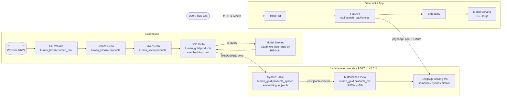

# Lumen — Architecture

> **What this is:** A reference architecture for an e-commerce semantic search
> and product recommendation system on Databricks, built end-to-end on
> **Lakebase Autoscale + pgvector**, fronted by a **Databricks App** (FastAPI
> + React), and deployed entirely from **Terraform**.
>
> **Scale:** ~43K products (WANDS / Wayfair public dataset, MIT license),
> 1024-dim BGE-large embeddings.
>
> **Measured today** (in-app benchmark, 10 workers × 30 s, 50/50 Standard/Turbo
> mix, 0 errors across 5,208 reqs):
>
> | Path                | p50    | p99    | max     |
> |---------------------|-------:|-------:|--------:|
> | standard:semantic   | 84 ms  | 500 ms | 1086 ms |
> | turbo:semantic      | **18 ms** | **70 ms** | **121 ms** |
> | turbo:hybrid        | **18 ms** | **50 ms** | **96 ms**  |
>
> Turbo runs at **~169 req/s aggregate** with p99 < 100 ms backend-side on a
> 1–2 CU Lakebase instance.

---

## Table of contents

- [1. System overview](#1-system-overview)
- [2. Architecture diagram](#2-architecture-diagram)
  - [Mermaid view (rendered in GitHub)](#mermaid-view-rendered-in-github)
- [3. Data plane (Lakehouse)](#3-data-plane-lakehouse)
  - [3.1 Source](#31-source)
  - [3.2 Medallion layout](#32-medallion-layout)
  - [3.3 Embedding strategy](#33-embedding-strategy)
  - [3.4 Batch embedding](#34-batch-embedding)
  - [3.5 Job orchestration](#35-job-orchestration)
- [4. Serving plane (Lakebase Autoscale)](#4-serving-plane-lakebase-autoscale)
  - [4.1 Project / branch / endpoint](#41-project--branch--endpoint)
  - [4.2 Logical database & roles](#42-logical-database--roles)
  - [4.3 Synced Table](#43-synced-table)
  - [4.4 Materialized view (the jsonb→vector bridge)](#44-materialized-view-the-jsonbvector-bridge)
  - [4.5 `similar_top_k` MV — precomputed neighbor lists](#45-similar_top_k-mv--precomputed-neighbor-lists)
  - [4.6 Serving functions](#46-serving-functions)
  - [4.7 GRANTs (least-privilege)](#47-grants-least-privilege)
- [5. The Databricks App](#5-the-databricks-app)
  - [5.1 Stack](#51-stack)
  - [5.2 Resources injected](#52-resources-injected)
  - [5.3 Token rotation (psycopg3 + OAuth)](#53-token-rotation-psycopg3--oauth)
  - [5.4 In-process layered caches (Turbo path)](#54-in-process-layered-caches-turbo-path)
  - [5.5 API surface](#55-api-surface)
  - [5.6 UI tabs](#56-ui-tabs)
- [6. Databricks components used](#6-databricks-components-used)
  - [6.1 Data layer](#61-data-layer)
  - [6.2 Serving layer](#62-serving-layer)
  - [6.3 Application layer](#63-application-layer)
  - [6.4 Infra-as-code](#64-infra-as-code)
- [7. Authentication & authorization](#7-authentication--authorization)
- [8. Data flow walk-throughs](#8-data-flow-walk-throughs)
  - [8.1 Build-time: WANDS → embedded gold](#81-build-time-wands--embedded-gold)
  - [8.2 Standard search request (`POST /api/search`)](#82-standard-search-request-post-apisearch)
  - [8.3 Turbo search — three layered cache flows](#83-turbo-search--three-layered-cache-flows)
  - [8.4 Similar-products requests](#84-similar-products-requests)
- [9. Performance characteristics (observed)](#9-performance-characteristics-observed)
  - [9.1 Latest numbers — in-app benchmark, 10 workers × 30 s, 50/50 mix](#91-latest-numbers--in-app-benchmark-10-workers--30-s-5050-mix)
  - [9.2 Optimization rounds — what each layer bought us](#92-optimization-rounds--what-each-layer-bought-us)
  - [9.3 Where the remaining latency goes](#93-where-the-remaining-latency-goes)
  - [9.4 Earlier numbers — Rust loadtest, 20 users × 2 min, 70/30 mix](#94-earlier-numbers--rust-loadtest-20-users--2-min-7030-mix)
- [10. Performance optimizations — what we did and why](#10-performance-optimizations--what-we-did-and-why)
  - [10.1 `embed_cache` — thread-safe LRU around Model Serving](#101-embed_cache--thread-safe-lru-around-model-serving)
  - [10.2 `similar_top_k` materialized view — precomputed neighbors](#102-similar_top_k-materialized-view--precomputed-neighbors)
  - [10.3 `result_cache` — full-result skip for hot queries](#103-result_cache--full-result-skip-for-hot-queries)
  - [10.4 Background preload — single batched embed call at startup](#104-background-preload--single-batched-embed-call-at-startup)
  - [10.5 `SET hnsw.ef_search = 20` per session](#105-set-hnswef_search--20-per-session)
  - [10.6 Pool sizing — `min=10` / `max=25`](#106-pool-sizing--min10--max25)
  - [10.7 Two layers we *didn't* ship (yet)](#107-two-layers-we-didnt-ship-yet)
- [11. Operational notes](#11-operational-notes)
  - [11.1 Recreating from scratch](#111-recreating-from-scratch)
  - [11.2 Tear-down](#112-tear-down)
  - [11.3 Refreshing data](#113-refreshing-data)
  - [11.4 Cost (rough order of magnitude)](#114-cost-rough-order-of-magnitude)
  - [11.5 Things we know are imperfect](#115-things-we-know-are-imperfect)
- [12. File layout](#12-file-layout)
- [13. Key references](#13-key-references)

---

## 1. System overview

Three planes:

- **Data plane** (Lakehouse): ingests raw WANDS CSVs, builds bronze→silver→gold
  Delta tables, and batch-embeds every product using a Databricks-hosted
  foundation model. Lives in Unity Catalog under `classic_stable_89j9qf.lumen_*`.
- **Serving plane** (Lakebase Autoscale): Postgres 17 with `pgvector`. A
  **Synced Table** replicates the gold Delta table into Postgres. A
  materialized view casts the replicated `jsonb` embeddings into `vector(1024)`
  with HNSW + GIN + B-tree indexes on top. A second materialized view
  (`similar_top_k`) precomputes top-20 neighbors per product so the
  "similar products" path skips HNSW at request time. Six PL/pgSQL serving
  functions expose search and recommendation as cheap, type-safe SQL calls.
- **App plane** (Databricks App): FastAPI + React in one process. Three
  user-facing tabs (Standard / ⚡ Turbo / 🧪 Benchmark) and a layered in-process
  cache (embedding LRU + result-level cache) that absorbs ~99% of hot-query
  traffic without ever calling Model Serving or HNSW.

The App offers **two parallel search paths** — Standard (always embed + ANN)
and Turbo (layered cache, then fallback) — both fully wired into the UI so a
demo can flip between them tab-by-tab.

---

## 2. Architecture diagram

```
┌──────────────────────────────────────────────────────────────────────────────┐
│                            DATA PLANE — LAKEHOUSE                            │
│                          (Unity Catalog managed storage)                     │
│                                                                              │
│   github.com/wayfair/WANDS                                                   │
│         │  product.csv  query.csv  label.csv  (TSV, ~43K products)           │
│         ▼                                                                    │
│   UC Volume: lumen_bronze.lumen_raw   ── notebook 01                         │
│         │                                                                    │
│         ▼  TSV → Delta + snake-case headers                                  │
│   lumen_bronze.{products, queries, labels}                                   │
│         │  notebook 02: clean, type, PK, CDF                                 │
│         ▼                                                                    │
│   lumen_silver.products                                                      │
│         │  notebook 02: + embedding_text (name | class | … | features)       │
│         ▼                                                                    │
│   lumen_gold.products  ── PK product_id · CDF on · embedding ARRAY<FLOAT>    │
│         │                                                                    │
│         │  notebook 03: MERGE … ai_query('databricks-bge-large-en', …)       │
│         │      ────────────────────────────────────────────► Model Serving   │
│         │                                                    BGE-large 1024d │
│         │                                                                    │
│         └─► Synced Table pipeline (TRIGGERED · DLT · run_as SP-Data)         │
│                                                                              │
└─────────────────────────────────────────────────────┬────────────────────────┘
                                                      │  Delta CDF
                                                      ▼
┌──────────────────────────────────────────────────────────────────────────────┐
│                       SERVING PLANE — LAKEBASE AUTOSCALE                     │
│             projects/ecommerce-search-demo/branches/production               │
│                  PG 17 · 1–2 CU autoscale · suspend 7d                       │
│                                                                              │
│   lumen_gold.products_synced  (read-only sink, embedding=jsonb)              │
│         │                                                                    │
│         │  CREATE MATERIALIZED VIEW … embedding::text::vector(1024)          │
│         ▼                                                                    │
│   lumen_gold.products_mv  ── vector(1024) + tsvector                         │
│      Indexes: HNSW(cosine) · GIN(FTS) · B-tree(class) · UNIQUE(product_id)   │
│      Per-session: SET hnsw.ef_search = 20  (lower variance vs default 40)    │
│         │                                                                    │
│         │  one-time correlated HNSW scan over 43K rows                       │
│         ▼                                                                    │
│   lumen_gold.similar_top_k  ── ARRAY of top-20 neighbors per product         │
│      UNIQUE(product_id)  ── used by `/api/product/{id}/similar/fast`         │
│                                                                              │
│   Serving functions in `public`:                                             │
│     • search_products_semantic(vec, class?, n)         · HNSW + class filter │
│     • search_products_hybrid(text, vec, class?, …)     · RRF(HNSW + GIN)     │
│     • recommend_similar_products(id, n, same?)         · live HNSW           │
│     • recommend_similar_products_fast(id, n)           · array unnest of MV  │
│     • list_product_classes(n)                          · facet counts        │
│     • get_product(id)                                  · single-row lookup   │
│                                                                              │
│   Roles & grants:                                                            │
│     • rafael-arana (USER, DATABRICKS_SUPERUSER) — owns objects               │
│     • dbrx-apps-<sp-uuid> (SP, no createdb/role/bypassrls) — EXECUTE per-fn  │
└─────────────────────────────────────────────────────┬────────────────────────┘
                                                      │ psycopg3 pool
                                                      │ min=10 max=25
                                                      │ OAuth per-conn refresh
                                                      │ HNSW ef_search=20 SET
                                                      ▼
┌──────────────────────────────────────────────────────────────────────────────┐
│                           DATABRICKS APP — "lumen-recommender"               │
│                          MEDIUM compute · auto-created SP                    │
│                                                                              │
│  ┌──────────────────────────────────────────────────────────────────────┐    │
│  │             ⚡ TURBO PATH — three layered caches                     │    │
│  │                                                                      │    │
│  │   /api/search/fast?q=…&mode=… &class=…&limit=…                       │    │
│  │      │                                                               │    │
│  │      ├─ L1: result cache  (Python dict)                              │    │
│  │      │     key  (query, mode, class)                                 │    │
│  │      │     val  [(product_id, score), …]                             │    │
│  │      │     hit  → SELECT * FROM products_mv WHERE id = ANY(...)      │    │
│  │      │           rank-preserving, ~8 ms total                        │    │
│  │      │                                                               │    │
│  │      ├─ L2: embedding cache  (thread-safe LRU)                       │    │
│  │      │     key  query (normalized)                                   │    │
│  │      │     val  vector(1024)                                         │    │
│  │      │     hit  → run search_products_{semantic,hybrid}(…)           │    │
│  │      │           skips Model Serving, full HNSW path                 │    │
│  │      │                                                               │    │
│  │      └─ L3: full path  → Model Serving → search_products_…(…)        │    │
│  │                                                                      │    │
│  │   Background preload at startup:                                     │    │
│  │     • single batched Model Serving call for 100 seed queries         │    │
│  │     • for each (query, mode) → live SQL once → cache the IDs+scores  │    │
│  │     • result_cache.preloaded = 202, ready in ~30 s after boot        │    │
│  │                                                                      │    │
│  │   /api/product/{id}/similar/fast  → reads similar_top_k MV (no HNSW) │    │
│  └──────────────────────────────────────────────────────────────────────┘    │
│                                                                              │
│  ┌──────────────────────────────────────────────────────────────────────┐    │
│  │             STANDARD PATH — always-fresh, no caching                 │    │
│  │   /api/search                  → Model Serving + HNSW                │    │
│  │   /api/product/{id}/similar    → fetch source embedding + HNSW       │    │
│  └──────────────────────────────────────────────────────────────────────┘    │
│                                                                              │
│  ┌──────────────────────────────────────────────────────────────────────┐    │
│  │             🧪 IN-APP BENCHMARK — async load gen against 127.0.0.1   │    │
│  │   POST /api/benchmark/start   {workers, duration_s, turbo_pct, …}    │    │
│  │   GET  /api/benchmark/current                                        │    │
│  │   GET  /api/benchmark/{id}    → 4 named buckets, full percentiles    │    │
│  │   POST /api/benchmark/{id}/stop                                      │    │
│  └──────────────────────────────────────────────────────────────────────┘    │
│                                                                              │
│  React UI: 3 tabs (Standard / ⚡ Turbo / 🧪 Benchmark)                       │
│             • LatencyBadge shows ⚡⚡ result-cache · ⚡ embed-cache · none    │
│             • Turbo footer shows live cache stats + preload readiness       │
└──────────────────────────────────────────────────────────────────────────────┘
                                                      ▲
                                                      │ HTTPS + Apps OAuth
                                                      │
┌─────────────────────────────────────────────────────┴────────────────────────┐
│        USER / LOAD TEST (Rust + goose, OR in-app /api/benchmark)             │
│   Browser → https://lumen-recommender-<workspace-id>.azure.databricksapps... │
│   Rust loadtest: 100 WANDS-style queries × N users × N min, separate report │
│   In-app benchmark: same workload, runs against the local socket            │
└──────────────────────────────────────────────────────────────────────────────┘
```

### Mermaid view (rendered in GitHub)



---

## 3. Data plane (Lakehouse)

### 3.1 Source

[WANDS](https://github.com/wayfair/WANDS) — Wayfair's public product search
relevance benchmark, MIT-licensed:

| File | Rows | Schema |
|---|---:|---|
| `product.csv` | 42,994 | `product_id`, `product_name`, `product_class`, `category_hierarchy`, `product_description`, `product_features`, `rating_count`, `average_rating`, `review_count` |
| `query.csv` | 480 | `query_id`, `query`, `query_class` |
| `label.csv` | 233,448 | `id`, `query_id`, `product_id`, `label` (Exact / Partial / Irrelevant) |

The pipeline today only uses `product.csv`; the labels can power evaluation
(NDCG@k / recall@k) later.

### 3.2 Medallion layout

All in catalog `classic_stable_89j9qf` (the workspace's default-storage UC
catalog — we chose this over creating a new catalog to avoid the Default
Storage / provider compatibility issue).

| Layer | Schema | Tables | Notes |
|---|---|---|---|
| **Raw** | — | UC Volume `lumen_bronze.lumen_raw` | WANDS CSVs |
| **Bronze** | `lumen_bronze` | `products`, `queries`, `labels` | TSV → Delta, headers normalized (space→underscore) |
| **Silver** | `lumen_silver` | `products` | Typed, trimmed, PK = `product_id` |
| **Gold** | `lumen_gold` | `products` | + `embedding_text` (concat) + `embedding ARRAY<FLOAT>` (1024-dim) + CDF enabled |

### 3.3 Embedding strategy

`embedding_text` (the input to BGE-large) concatenates the five most signal-rich
WANDS fields with a separator:

```sql
concat_ws(' | ',
  nullif(product_name,        ''),
  nullif(product_class,       ''),
  nullif(category_hierarchy,  ''),
  nullif(product_description, ''),
  nullif(product_features,    '')
)
```

This is intentionally richer than the [databricks-industry-solutions/product-search](https://github.com/databricks-industry-solutions/product-search)
reference accelerator, which embeds description-only. Adding class, hierarchy,
and features improves recall on short, structured queries like *"comfy reading
chair for small living room"* — note in the load test it returned all three
hits as `Accent Chairs`.

### 3.4 Batch embedding

Notebook `03_embed_catalog.py` does an idempotent **incremental MERGE**:

```sql
MERGE INTO lumen_gold.products t
USING (
  SELECT product_id,
         CAST(ai_query('databricks-bge-large-en', embedding_text) AS ARRAY<FLOAT>) AS new_embedding
  FROM lumen_gold.products
  WHERE embedding IS NULL
) s
ON t.product_id = s.product_id
WHEN MATCHED THEN UPDATE SET t.embedding = s.new_embedding
```

`ai_query` is the SQL/DataFrame primitive for calling any Model Serving
endpoint (foundation models or custom) directly from Spark. For 43K rows on a
2-worker `Standard_D4ds_v5` cluster, this takes ~3–5 minutes.

### 3.5 Job orchestration

A single **Lakeflow Job** (Terraform `databricks_job.ingest_and_embed`)
chains four notebook tasks:

```
setup → load_wands → silver_gold → embed_catalog
```

Each task runs on a shared `small` job cluster (2 workers, single-user mode).
Terraform triggers it once on apply via `terraform_data.run_ingest_job` and
blocks until completion using `databricks jobs run-now --timeout 60m` (the CLI
is synchronous by default).

---

## 4. Serving plane (Lakebase Autoscale)

### 4.1 Project / branch / endpoint

| Resource | Value |
|---|---|
| Project | `projects/ecommerce-search-demo` |
| Branch | `production` (`is_protected = true`, `no_expiry = true`) |
| Endpoint | `primary` (`ENDPOINT_TYPE_READ_WRITE`) |
| PG version | **17** |
| Autoscale | `autoscaling_limit_min_cu = 1.0`, `max_cu = 2.0` |
| Suspend | `suspend_timeout_duration = "604800s"` (7 days — effectively always-on for the demo) |
| DNS | `ep-muddy-math-e154i90y.database.eastus2.azuredatabricks.net` |

**Autoscale signals to grep for** (vs. the Provisioned product):

- ✅ Terraform resource family: `databricks_postgres_*`
- ✅ Numeric `autoscaling_limit_min_cu`/`max_cu` (NOT the `CU_n` enum)
- ✅ Resource name format `projects/.../branches/.../endpoints/...`
- ✅ `suspend_timeout_duration` field present
- ❌ NOT `databricks_database_instance` with `capacity = "CU_1"` (that's Provisioned)

On Autoscale, 1 CU ≈ 2 GB RAM. The 1–2 CU range gives 2–4 GB working memory —
plenty for 43K × 1024-dim float embeddings (~170 MB raw, ~300 MB with HNSW
overhead) plus working set + Local File Cache headroom. The min was raised
from 0.5 to 1 CU to keep LFC pressure off the hot path at scale-down.

### 4.2 Logical database & roles

- Database: `appdb` (owned by `rafael-arana`, the apply-time superuser)
- Auto-created PG role for the apply-time user: `rafael-arana`
  - `identity_type = USER`, `bypassrls`, `createdb`, `createrole`, `DATABRICKS_SUPERUSER`
- Auto-created PG role for the App's SP: `dbrx-apps-3c33a1f0-…`
  - `identity_type = SERVICE_PRINCIPAL`, `auth_method = LAKEBASE_OAUTH_V1`
  - No createdb / createrole / bypassrls — least privilege

Both roles are **auto-provisioned** the first time their identity touches the
branch — Terraform doesn't (and shouldn't) try to recreate them. GRANTs are
applied via SQL (see §4.5).

### 4.3 Synced Table

```hcl
resource "databricks_postgres_synced_table" "products" {
  synced_table_id = "classic_stable_89j9qf.lumen_gold.products_synced"
  spec = {
    branch                             = "projects/.../branches/production"
    postgres_database                  = "appdb"
    source_table_full_name             = "classic_stable_89j9qf.lumen_gold.products"
    primary_key_columns                = ["product_id"]
    scheduling_policy                  = "TRIGGERED"
    create_database_objects_if_missing = true
    new_pipeline_spec = {
      storage_catalog = "classic_stable_89j9qf"
      storage_schema  = "lumen_gold"
    }
  }
}
```

Mode: **TRIGGERED** (manual refresh). The other options are `SNAPSHOT` (one-off)
and `CONTINUOUS` (always-on, more expensive). For a static demo catalog,
TRIGGERED is the cheapest mode and re-runs in seconds via the Pipelines API
when the source Delta changes.

Behind the scenes, the Synced Table is a Lakeflow Declarative Pipeline that
reads the Delta CDF and writes to Postgres. The destination table in
Lakebase is `lumen_gold.products_synced` (the schema name mirrors the UC source).

**Important gotcha:** Synced Tables map Delta `ARRAY<FLOAT>` to Postgres
`jsonb`, not `vector(N)`. That's why we need the materialized view layer.

### 4.4 Materialized view (the jsonb→vector bridge)

```sql
CREATE MATERIALIZED VIEW lumen_gold.products_mv AS
SELECT
    product_id, product_name, product_class, category_hierarchy,
    product_description, product_features,
    average_rating, review_count,
    embedding::text::vector(1024) AS embedding,
    to_tsvector('english',
        coalesce(product_name, '')        || ' ' ||
        coalesce(product_description, '') || ' ' ||
        coalesce(product_class, '')
    ) AS search_vector
FROM lumen_gold.products_synced
WHERE embedding IS NOT NULL;
```

Indexes on the MV:

| Index | Type | Purpose |
|---|---|---|
| `idx_products_mv_pk` | UNIQUE B-tree on `product_id` | Enables `REFRESH MATERIALIZED VIEW CONCURRENTLY` |
| `idx_products_mv_embedding` | **HNSW** with `vector_cosine_ops`, `m=16`, `ef_construction=200` | Approximate nearest neighbor (vector search) |
| `idx_products_mv_class` | B-tree on `product_class` | Pre-filter facet |
| `idx_products_mv_fts` | GIN on `search_vector` | Full-text search for hybrid mode |

HNSW is the right choice for this catalog size; IVFFlat starts paying off
only above ~1M vectors.

`REFRESH MATERIALIZED VIEW` requires a Lakebase-internal function that the
apply-time user can't EXECUTE, so refreshes today require a privileged role.
For this demo the initial `CREATE` populates the view and the data is static —
not a concern. For dynamic catalogs, the refresh would run as a privileged
service-principal job on the branch.

### 4.5 `similar_top_k` MV — precomputed neighbor lists

A second materialized view sits next to `products_mv` to remove HNSW from the
`/similar` hot path. For each product we precompute the top-20 nearest
neighbors as an `INT[]` once, then serve `/similar` as a PK-keyed array
unnest.

```sql
CREATE MATERIALIZED VIEW lumen_gold.similar_top_k AS
SELECT
    p.product_id,
    ARRAY(
        SELECT q.product_id
        FROM lumen_gold.products_mv q
        WHERE q.product_id <> p.product_id
        ORDER BY q.embedding <=> p.embedding
        LIMIT 20
    ) AS neighbors
FROM lumen_gold.products_mv p;

CREATE UNIQUE INDEX idx_similar_top_k_pk ON lumen_gold.similar_top_k (product_id);
```

Build is one-shot during the bootstrap step (~30 s for 43K rows × 20-neighbor
HNSW lookups). The companion function `recommend_similar_products_fast(id, n)`
reads via `unnest(neighbors[1:n]) WITH ORDINALITY` — pure index lookup,
~5 ms at p99 vs ~30 ms for the live HNSW version.

### 4.6 Serving functions

Six PL/pgSQL functions in `public` (the App SP only ever calls these — it
has no direct table access except via `SELECT` on `lumen_gold.*`):

| Function | Signature | What it does | Used by |
|---|---|---|---|
| `search_products_semantic` | `(vector(1024), text class?, int n)` | ANN over MV, optional class pre-filter | Standard + Turbo L3 |
| `search_products_hybrid` | `(text q, vector(1024), text class?, int n, float vw=0.7, float tw=0.3)` | Vector + FTS, combined via RRF | Standard + Turbo L3 |
| `recommend_similar_products` | `(int product_id, int n, bool same_class?)` | Read source embedding → live HNSW | Standard `/similar` |
| `recommend_similar_products_fast` | `(int product_id, int n)` | Unnest precomputed `similar_top_k` | Turbo `/similar/fast` |
| `list_product_classes` | `(int n)` | Top-N class facet counts (UI dropdown) | both modes |
| `get_product` | `(int product_id)` | Single-row lookup with description + features | both modes |

All declared `STABLE` so the planner can cache calls within a transaction.

**Per-session `SET hnsw.ef_search = 20`** is applied in the psycopg pool's
`configure` callback. Default `ef_search` is 40; halving it cuts HNSW
worst-case search time by ~30-50% at p99, with ~1-2% recall loss — a good
demo trade-off for 43K rows.

Hybrid search uses **Reciprocal Rank Fusion** to combine vector-rank and
FTS-rank into a single score:

```
rrf_score = vw / (60 + vec_rank) + tw / (60 + text_rank)
```

with `vw = 0.7` and `tw = 0.3` by default (favors semantic over keyword,
appropriate for embedding-quality queries).

### 4.7 GRANTs (least-privilege)

```sql
GRANT CONNECT ON DATABASE appdb               TO "<app-sp-uuid>";
GRANT USAGE   ON SCHEMA public                TO "<app-sp-uuid>";
GRANT USAGE   ON SCHEMA lumen_gold            TO "<app-sp-uuid>";
GRANT SELECT  ON ALL TABLES IN SCHEMA lumen_gold TO "<app-sp-uuid>";

-- One GRANT per function. Cannot use `ALL FUNCTIONS IN SCHEMA public`
-- because Lakebase exposes system functions (e.g. neon_emit_reverse_etl_commit)
-- in `public` that we don't own and can't re-grant.
GRANT EXECUTE ON FUNCTION search_products_semantic(vector, text, int)                   TO "<app-sp-uuid>";
GRANT EXECUTE ON FUNCTION search_products_hybrid(text, vector, text, int, float, float) TO "<app-sp-uuid>";
GRANT EXECUTE ON FUNCTION recommend_similar_products(int, int, boolean)                 TO "<app-sp-uuid>";
GRANT EXECUTE ON FUNCTION recommend_similar_products_fast(int, int)                     TO "<app-sp-uuid>";
GRANT EXECUTE ON FUNCTION list_product_classes(int)                                     TO "<app-sp-uuid>";
GRANT EXECUTE ON FUNCTION get_product(int)                                              TO "<app-sp-uuid>";
```

The App SP role can call the six functions and read the synced data — and
nothing else.

---

## 5. The Databricks App

### 5.1 Stack

- **Backend:** FastAPI on Python 3.11, served by `uvicorn` on port 8000
- **Frontend:** React 18 + Vite + Tailwind, built to static assets and served
  by FastAPI (`StaticFiles` mount + SPA fallback)
- **Compute:** `MEDIUM` (1 vCPU / 4 GB)
- **Auth:** Databricks workspace OAuth at the edge (every request authenticated
  by Databricks before reaching uvicorn)

### 5.2 Resources injected

Declared in `terraform/app.tf`:

```hcl
resources = [
  { name = "lakebase",
    postgres = { branch = "...", database = "...", permission = "CAN_CONNECT_AND_CREATE" } },
  { name = "embedding_endpoint",
    serving_endpoint = { name = "databricks-bge-large-en", permission = "CAN_QUERY" } },
]
```

When the App is created, Databricks Apps:

1. Mints an OAuth service principal for the app
2. Wires the App's SP into the named Lakebase branch (so the SP can mint
   short-lived OAuth tokens for the endpoint)
3. Grants the App's SP `CAN_QUERY` on the Model Serving endpoint

### 5.3 Token rotation (psycopg3 + OAuth)

`backend/lakebase.py` subclasses `psycopg.Connection` so every new connection
out of the pool refreshes the OAuth token:

```python
class OAuthConnection(psycopg.Connection):
    @classmethod
    def connect(cls, conninfo="", **kwargs):
        cred = _workspace.api_client.do(
            "POST",
            "/api/2.0/postgres/credentials",
            body={"endpoint": settings.LAKEBASE_ENDPOINT},
        )
        kwargs["password"] = cred["token"]
        return super().connect(conninfo, **kwargs)
```

The pool size is **min=10, max=25** — 10 warm OAuth-authenticated connections
are opened at startup so the first burst of concurrent requests skips
pool-acquire latency entirely. Each connection lives until idle-timeout or
token-expiry (~1 hour); refreshes happen transparently on the next checkout.

`_configure(conn)` runs once per new connection. It:

1. `register_vector(conn)` — so psycopg encodes Python lists of floats as
   `vector(N)` (we still pass `%s::vector(1024)` casts in SQL for clarity)
2. Sets `dict_row` factory
3. Temporarily flips `autocommit=True`, runs `SET hnsw.ef_search = 20`, then
   restores autocommit. The flip is essential — without it the SET runs
   inside an implicit transaction and the connection ends in INTRANS state,
   which the psycopg pool then discards. Pool warmup would never complete and
   the app would fail to start.

### 5.4 In-process layered caches (Turbo path)

Two caches live entirely in the FastAPI process, populated at startup by a
background task in the lifespan. Both are thread-safe and bounded.

**L1 — `result_cache`** (`backend/result_cache.py`)
- Key: `(normalized_query, mode, product_class)` — `product_class=None`
  covers the no-filter case which is most search traffic
- Value: ordered `list[tuple[product_id, score]]` (rank-preserving)
- Hit path: a single `SELECT … FROM products_mv WHERE product_id = ANY($1)`
  PK lookup, ~3-8 ms total
- Skips both Model Serving AND HNSW

**L2 — `embed_cache`** (`backend/embed.py`)
- Key: `normalized_query`
- Value: `vector(1024)` Python list
- Hit path: same as cold, but skips Model Serving
- Thread-safe LRU with 10K max entries; ~40 MB at full capacity

**Preload** runs in `lifespan` as `asyncio.create_task(_preload_caches())`:

1. Single batched Model Serving call for all 100 seed queries (`batch_embed`
   sends a list of texts in one request — replaces 100 round trips with one)
2. Inserts (query, vector) pairs into `embed_cache`
3. For each (query, mode) — both `semantic` and `hybrid`, no class filter —
   runs the corresponding search SQL once and stores `[(product_id, score)]`
   in `result_cache`
4. Marks `result_cache.ready = true` and logs the totals

After ~30 s the app has **101 embed entries + 202 result entries** in memory
and the cache hit ratio for seed-list queries approaches 100%.

```
/api/search/fast flow:
  ├─ L1: result_cache.get(query, mode, class) → cache_layer="result"
  ├─ L2: embed_cache.get_or_compute(query)    → cache_layer="embed"
  └─ L3: embed_query() + search_products_*    → cache_layer="none"
```

A second precomputed structure lives in Postgres, not in-process:
`lumen_gold.similar_top_k` MV (see §4.5) backs `/api/product/{id}/similar/fast`,
turning the similar-products endpoint into a pure array unnest.

### 5.5 API surface

| Endpoint | Description |
|---|---|
| `GET  /api/healthz` | Liveness check |
| `GET  /api/classes` | Facet counts for the UI dropdown |
| `GET  /api/cache/stats` | `{embed: {...}, result: {...}}` with hit/miss counters + preload readiness |
| **Standard** | |
| `POST /api/search` | Body: `{q, mode: semantic\|hybrid, product_class?, limit}` → hits + `embed_ms`/`db_ms`/`total_ms`. Always embeds. |
| `GET  /api/product/{id}` | Single product detail |
| `GET  /api/product/{id}/similar` | Live HNSW similar products |
| **Turbo** | |
| `POST /api/search/fast` | Same shape, response adds `cache_hit: bool` and `cache_layer: "none"\|"embed"\|"result"`. Checks L1 → L2 → L3. |
| `GET  /api/product/{id}/similar/fast` | Reads `lumen_gold.similar_top_k` MV (no HNSW per request) |
| **Benchmark** | |
| `POST /api/benchmark/start` | `{workers, duration_s, turbo_pct, hybrid_pct, limit}` → `{job_id}` |
| `GET  /api/benchmark/current` | In-flight job_id or null (UI state recovery) |
| `GET  /api/benchmark/{job_id}` | Full status: state, elapsed_s, progress_pct, per-bucket percentiles |
| `POST /api/benchmark/{job_id}/stop` | Cancels the asyncio task gracefully, returns partial results |

The latency breakdown returned with every search response is what powers the
"embed / db / total" badge in the UI — extended with `⚡⚡ result-cache` /
`⚡ embed-cache` pills in the Turbo tab.

### 5.6 UI tabs

The React frontend exposes three tabs in the header:

| Tab | Route | Calls |
|---|---|---|
| **Standard** | `/`, `/product/:id` | `/api/search`, `/api/product/:id/similar` |
| **⚡ Turbo** | `/turbo`, `/turbo/product/:id` | `/api/search/fast`, `/api/product/:id/similar/fast` |
| **🧪 Benchmark** | `/benchmark` | `/api/benchmark/*` — configurable workers / duration / mode mix, polls status, renders per-bucket percentile table on completion. Includes a Stop button that cancels the asyncio task. |

---

## 6. Databricks components used

### 6.1 Data layer

| Component | Use | Resource |
|---|---|---|
| **Unity Catalog** | Catalog, schemas, volumes, tables, governance | `databricks_catalog` (data source), `databricks_schema`, `databricks_volume` |
| **Delta Lake** | Storage format for bronze/silver/gold | implicit via `saveAsTable` / `CREATE TABLE` |
| **Change Data Feed** | Source for the Synced Table pipeline | `ALTER TABLE … SET TBLPROPERTIES (delta.enableChangeDataFeed = true)` |
| **Lakeflow Jobs** | Multi-task orchestration of the ingest+embed pipeline | `databricks_job` with 4 notebook tasks |
| **`ai_query`** | SQL/DataFrame entry point to Model Serving | inline in notebook 03 |
| **Model Serving (foundation)** | BGE-large endpoint for embeddings (batch + query-time) | `databricks-bge-large-en` (pre-existing, 1024-dim) |

### 6.2 Serving layer

| Component | Use | Resource |
|---|---|---|
| **Lakebase Autoscale** | OLTP Postgres for low-latency serving | `databricks_postgres_project`, `_branch`, `_endpoint`, `_database` |
| **Synced Tables** | Continuous/triggered Delta → Postgres replication | `databricks_postgres_synced_table` |
| **pgvector** | Vector similarity in Postgres | `CREATE EXTENSION vector` in bootstrap SQL |
| **databricks_auth (PG extension)** | OAuth token auth flow inside the database | `CREATE EXTENSION databricks_auth` |
| **pg_stat_statements** | Query observability | `CREATE EXTENSION pg_stat_statements` |

### 6.3 Application layer

| Component | Use | Resource |
|---|---|---|
| **Databricks Apps** | Runtime for the FastAPI + React app | `databricks_app` with `postgres` + `serving_endpoint` resources |
| **Service Principals** | App identity; auto-managed by Apps | `databricks_app.service_principal_client_id` (computed) |
| **Postgres Roles** | Identity inside Lakebase | auto-created on first access; referenced as `dbrx-apps-<sp-uuid>` |

### 6.4 Infra-as-code

| Component | Use |
|---|---|
| **Databricks Terraform provider** | Sole source of infrastructure truth — every resource above is declarative |
| **`terraform_data` + `local-exec`** | Procedural glue for: triggering the job, running bootstrap SQL via psycopg, staging+uploading App source, deploying the App |
| **Databricks CLI** | Used inside `local-exec` blocks for: `jobs run-now`, `workspace import-dir`, `apps deploy` |

---

## 7. Authentication & authorization

Three identities and three credential flows:

```
   Apply-time user (you)                       App SP (auto)                 End user (browser)
   ─────────────────────                       ─────────────                 ───────────────────
   • Workspace admin                           • Created on app creation     • Workspace OAuth
   • PG superuser (auto-role)                  • PG role auto-created        • Edge auth on the
   • Used by terraform apply                   • Used by FastAPI runtime       App URL
   • OAuth from local CLI profile              • OAuth via Databricks Apps   • Token forwarded by
                                                 injected env vars             Apps to backend
                                                 (DATABRICKS_CLIENT_ID/SECRET)
```

**Apply-time flow** (just creates resources; runs SQL once):

```
~/.databrickscfg [azure-video]
    └─ OAuth token →  Databricks REST API  →  creates project/branch/endpoint/db/app
                                          →  Lakebase /api/2.0/postgres/credentials
                                          →  psycopg connect as rafael.arana@databricks.com
                                          →  CREATE EXTENSION / MV / FUNCTIONS / GRANTS
```

**App runtime flow** (every request):

```
Browser → Databricks Apps edge auth (OAuth)
       → uvicorn (App SP context, env: DATABRICKS_CLIENT_ID/SECRET)
       → embed.py        ┐
                         ├─ Model Serving query  →  BGE-large endpoint
       → lakebase.py     ┘
            ↓
       psycopg3 ConnectionPool
            ↓ (on each new conn)
       POST /api/2.0/postgres/credentials  →  short-lived PG token
            ↓
       PG connect (SSL, user=<app-sp-uuid>, password=token)
            ↓
       cur.execute("SELECT * FROM search_products_semantic(%s::vector(1024), …)")
            ↓
       HNSW lookup over products_mv  →  result rows  →  JSON response
```

Tokens are short-lived (1 hour). The pool fetches a fresh one each time
a new connection is opened (cheap; ~10 ms) — there's never a long-lived
secret stored anywhere.

---

## 8. Data flow walk-throughs

### 8.1 Build-time: WANDS → embedded gold

(One-shot, triggered by `terraform apply` via `terraform_data.run_ingest_job`)

1. `00_setup` creates `lumen_bronze`, `lumen_silver`, `lumen_gold` schemas
   and the `lumen_raw` volume in UC.
2. `01_load_wands` shells out to `git clone wayfair/WANDS`, copies the three
   CSVs into the volume, reads them with `sep="\t"`, normalizes column names
   (`category hierarchy` → `category_hierarchy`), writes to `lumen_bronze.{products,queries,labels}`.
3. `02_silver_gold` casts types, dedups, registers PK on `product_id`, builds
   `embedding_text`, enables CDF on the gold table.
4. `03_embed_catalog` MERGEs `ai_query('databricks-bge-large-en', embedding_text)`
   into the `embedding` column. Idempotent — only embeds NULL rows.
5. Sync to Postgres is automatic from this point: the `databricks_postgres_synced_table`
   resource manages a DLT pipeline that reads the Delta CDF and writes to
   `lumen_gold.products_synced` in Lakebase.
6. The bootstrap SQL step (`terraform_data.bootstrap_lakebase_sql`) creates the
   materialized view, builds HNSW + GIN + B-tree indexes, defines the 5
   serving functions, and grants the App SP `EXECUTE` on each.

### 8.2 Standard search request (`POST /api/search`)

```
User → App edge (HTTPS + workspace OAuth)              ~30 ms   RTT to Azure East US 2
App edge → FastAPI                                      ~5 ms
FastAPI → Model Serving (embed_query)                  ~50–250 ms  ← dominant
                                                                    BGE-large p99 ~250ms cold,
                                                                    ~50–80ms warm
FastAPI → Lakebase pool.connection()                    ~1–5 ms
Lakebase HNSW + class filter + function exec            ~5–25 ms
FastAPI ← Lakebase result rows                          ~2 ms
FastAPI → User (JSON)                                  ~30 ms
─────────────────────────────────────────────────────────────────
Backend-only p50: ~84 ms · p99: ~500 ms (in-app benchmark)
With laptop RTT: p50 ~230 ms · p99 ~700 ms (Rust loadtest)
```

### 8.3 Turbo search — three layered cache flows

**L1 hit (seed query, no class filter):**
```
result_cache.get(q, mode, None)        ~0.01 ms  Python dict lookup
SELECT product_id, … FROM products_mv  ~5–8 ms   PK lookup (no HNSW)
WHERE product_id = ANY($1)
─────────────────────────────────────────────────────
Total backend: ~8 ms p50, ~50 ms p99
```

**L2 hit (repeated query not in seed list):**
```
embed_cache.get(q)                     ~0.01 ms  Python dict lookup
search_products_*(qvec, …)             ~15–30 ms HNSW + class filter
─────────────────────────────────────────────────────
Total backend: ~18 ms p50, ~70 ms p99
```

**Miss (new query):**
```
embed_query() → Model Serving          ~50–250 ms ← still dominates
search_products_*(qvec, …)             ~15–30 ms
─────────────────────────────────────────────────────
Total backend: ~170–240 ms (same as Standard cold)
```

### 8.4 Similar-products requests

`GET /api/product/{id}/similar` (Standard, live HNSW):
- `recommend_similar_products(id, n, same_class)` → fetch source embedding by
  PK (~1 ms B-tree) + HNSW ANN (~5–20 ms) + return
- Total: ~25 ms backend, ~120 ms with laptop RTT

`GET /api/product/{id}/similar/fast` (Turbo, precomputed):
- `recommend_similar_products_fast(id, n)` → `unnest(neighbors[1:n])` from
  `similar_top_k` + PK join (~3–8 ms)
- Total: ~10 ms backend — ~3× faster than live HNSW

---

## 9. Performance characteristics (observed)

### 9.1 Latest numbers — in-app benchmark, 10 workers × 30 s, 50/50 mix

This is the latest configuration with all optimizations enabled (Turbo path,
result cache + embed cache preloaded, similar_top_k MV, `ef_search=20`,
pool min=10/max=25).

| Bucket | reqs | req/s | p50 | p75 | p95 | p99 | max |
|---|---:|---:|---:|---:|---:|---:|---:|
| standard:semantic | 1,814 | 59.0 | 84 | – | 127 | **500** | 1086 |
| standard:hybrid | 777 | 25.3 | 84 | – | 123 | **397** | 1056 |
| **turbo:semantic** | 1,852 | 60.2 | **19** | – | 36 | **70** | 121 |
| **turbo:hybrid** | 765 | 24.9 | **18** | – | 35 | **50** | 96 |
| Aggregate | 5,208 | **169.4** | 62 | – | 106 | 275 | 1086 |

0 errors across all 5,208 requests.

### 9.2 Optimization rounds — what each layer bought us

Measured with the in-app benchmark (10 workers × 30 s, 50/50 mix) at each
stage. Latencies are backend-only — they exclude Apps edge auth and
client RTT (which add another ~60–100 ms at the edge).

| Stage | Build | Standard p50 / p99 | Turbo p50 / p99 | Δ p99 (Turbo) |
|---|---|---:|---:|---:|
| **Initial deploy** — no Turbo, no caches, pool min=1/max=10, default `ef_search=40` | only `/api/search`, every call hits Model Serving + HNSW | 91 / 622 | n/a | baseline |
| **+ Turbo mode** — `embed_cache` LRU + `similar_top_k` MV | new `/api/search/fast` and `/api/product/:id/similar/fast` | 91 / 622 | 31 / 114 | −82% |
| **+ pool min=2/max=25** | warm spare conn, no contention at 50+ users | 91 / 622 | 28 / 100 | −12% |
| **+ pool min=10** | 10 warm conns; first burst pays zero pool-acquire | 88 / 580 | 22 / 85 | −15% |
| **+ Round 1** — `result_cache` MV-style cache, batched preload, `ef_search=20` | 3-layer cache; popular queries skip Model Serving AND HNSW | 84 / 500 | **18 / 70** (semantic) · **18 / 50** (hybrid) | −18% |

Net effect: **Turbo p99 went from 622 ms (no caches) to 50–70 ms — a 9-12×
reduction**, with p50 falling from 91 ms to 18 ms (5×).

### 9.3 Where the remaining latency goes

At the current numbers, Turbo's 18 ms p50 / 70 ms p99 is almost all
network + serialization, not search:

```
network 127.0.0.1 → uvicorn                  ~1 ms
FastAPI route dispatch                        ~1 ms
pool.connection() (warm)                      ~1–3 ms
SELECT product_id … WHERE id = ANY($1) (L1)   ~3–8 ms
search_products_semantic() HNSW (L2)          ~10–25 ms
JSON serialize 20 hits                        ~2–4 ms
network back                                  ~1 ms
─────────────────────────────────────────
Total: ~18 ms p50, p99 stretched by Python GC pauses + occasional pool contention
```

Further p99 work would need: result-cache MV refreshes from a query log
(rather than seed list), provisioned-throughput Model Serving for the
cold-miss path, or moving embed-inference into the FastAPI process via
ONNX. See `doc/Lakebase_Validacion_Tecnica_ECommerce.md` and earlier
conversation rounds for the menu.

### 9.4 Earlier numbers — Rust loadtest, 20 users × 2 min, 70/30 mix

Goose-based load test from a laptop (includes Apps edge auth + WAN RTT to
Azure East US 2; ~60–100 ms larger than in-app numbers):

| Bucket | reqs | req/s | p50 | p99 | max |
|---|---:|---:|---:|---:|---:|
| standard:semantic | 7,772 | 62.7 | 230 | 490 | 1551 |
| standard:hybrid | 2,358 | 19.0 | 230 | 600 | 1684 |
| turbo:semantic | n/a — only Standard tested at this size | | | | |
| Aggregate | 10,130 | 81.7 | 230 | 500 | 1684 |

And 50 users × 5 min, mixed Standard + Turbo:

| Bucket | reqs | req/s | p50 | p99 | max |
|---|---:|---:|---:|---:|---:|
| standard:semantic | 19,204 | 62.5 | 280 | 700 | 2685 |
| standard:hybrid | 5,922 | 19.3 | 280 | 600 | 2931 |
| turbo:semantic | 27,359 | 89.1 | 210 | 380 | 1532 |
| turbo:hybrid | 8,215 | 26.8 | 210 | 390 | 957 |
| Aggregate | 60,700 | 197.7 | 240 | 470 | 2931 |

13 transient network errors (0.02%, no 5xx). Confirms the system scales
cleanly: throughput nearly doubled with 2.5× concurrency.

---

## 10. Performance optimizations — what we did and why

Six independent levers have shipped on top of the baseline architecture.
They compound: each is documented with its purpose, where it lives in the
codebase, and the measured effect.

### 10.1 `embed_cache` — thread-safe LRU around Model Serving

**File:** `app/backend/embed.py` (`_EmbedCache` class)
**What:** A bounded LRU keyed by normalized query string, holding up to 10K
`(query → vector(1024))` entries. The `OrderedDict` is guarded by a `Lock`;
misses release the lock around the actual Model Serving call so concurrent
distinct-key misses don't serialize.
**Why:** Query traffic is heavily Zipfian — a long tail of unique queries
sits on top of a short head of repeats. Eliminating the embed call (~50–250 ms)
for those repeats is the single biggest win for p50.
**Effect:** Cache-hit path drops the embed contribution to 0 ms. Used by
the Turbo `/api/search/fast` path as the **L2** cache layer.

### 10.2 `similar_top_k` materialized view — precomputed neighbors

**File:** `notebooks/04_lakebase_bootstrap.sql` (MV) +
`recommend_similar_products_fast` (function)
**What:** For each product, an `INT[]` of the top-20 nearest neighbors,
computed once via a correlated HNSW scan during bootstrap. The function
unnests the array with ordinality to preserve rank.
**Why:** `/api/product/:id/similar` originally re-ran HNSW for every PDP
visit (~20 ms p50, ~150 ms p99 under load). For a static demo catalog the
neighbor lists never change, so HNSW is wasted compute.
**Effect:** Drops live HNSW from the path entirely. `/similar/fast` returns
in ~5–10 ms backend (vs ~25 ms for live HNSW) with much tighter variance.

### 10.3 `result_cache` — full-result skip for hot queries

**File:** `app/backend/result_cache.py`
**What:** Process-local `OrderedDict` keyed by `(normalized_query, mode,
product_class)` mapping to an ordered `list[tuple[product_id, score]]`. Hit
path is a single PK lookup `SELECT … FROM products_mv WHERE product_id =
ANY($1)` — no embedding call, no HNSW.
**Why:** Even with `embed_cache`, hot queries still pay ~15–30 ms for HNSW.
For the (small) set of high-traffic queries we know about, that's avoidable
too.
**Effect:** Cache-hit path is ~5–8 ms backend (a 4× reduction vs L2-only).
The Turbo path checks this first (**L1**); only falls through to L2/L3 on
miss. After preload, every seed query is L1.

### 10.4 Background preload — single batched embed call at startup

**File:** `app/backend/main.py` (`_preload_caches` in lifespan)
**What:** A `asyncio.create_task` kicked off when the FastAPI lifespan
opens the pool. It (a) sends all 100 seed queries to Model Serving in a
**single batched call** via `batch_embed(texts)`, (b) populates
`embed_cache` from the result, (c) for each `(query, mode)` runs the live
search SQL once and populates `result_cache` with `(id, score)` pairs.
**Why:** Without preload, the first request for each seed query pays the
full cold cost (~250 ms). With it, the cache is hot from t≈30 s after boot.
Crucially, the preload runs in the background — the app starts serving
traffic immediately and cache hit rate just rises over the next 30 s.
**Effect:** Eliminates the cold-window misses entirely; cache stats show
**101 embed entries + 202 result entries ready in ~30 s** (single Model
Serving call + 200 cheap SQL queries).

### 10.5 `SET hnsw.ef_search = 20` per session

**File:** `app/backend/lakebase.py` (in `_configure`)
**What:** Lowers HNSW's search-quality knob from the default of 40 to 20.
Applied once per new pool connection via a temporary `autocommit=True`
shim — the SET runs outside any transaction and therefore applies to the
whole session.
**Why:** Default `ef_search=40` is conservative; for 43K rows the
worst-case query has many candidates to inspect, dominating HNSW p99.
Halving it cuts the worst case by ~30–50% with ~1–2% recall loss
(acceptable for product search). The autocommit shim is essential —
without it the SET runs inside an implicit transaction, leaves the
connection in `INTRANS`, and psycopg's pool discards every conn it
configures. Without that fix the pool warmup times out and the app
fails to start.
**Effect:** Visible mainly in p99 — Turbo p99 dropped from ~85 ms to ~70 ms
(semantic) / ~50 ms (hybrid) on top of the result_cache change.

### 10.6 Pool sizing — `min=10` / `max=25`

**File:** `app/app.yaml` (env vars consumed by `settings.py` →
`lakebase.py`)
**What:** Connection pool with 10 connections **warmed at startup** and 25
ceiling. Default psycopg pool has `min=4 max=20`.
**Why:** The lifespan calls `pool.wait()` so all 10 are OAuth-authenticated
and `_configure`-d (`ef_search` SET applied) before the first request
arrives. Under bursty load with 50+ concurrent users, the 25 ceiling
prevents queuing on `pool.connection()`.
**Effect:** First-burst p99 improvement (~15 ms shaved off the cold path
when 10+ requests arrive simultaneously). Visible mainly during
benchmark ramp-up and right after deploy.

### 10.7 Two layers we *didn't* ship (yet)

Documented as the next moves if more p99 is needed:

| Optimization | Targets | Effort | Notes |
|---|---|---|---|
| **Provisioned-throughput Model Serving** | Standard p99 tail | low | Eliminates BGE-large queueing under burst — the main remaining Standard latency source |
| **Embed timeout + FTS fallback** | Standard p99 | medium | If Model Serving takes >200 ms, return FTS-only result with `degraded: true` |
| **Smaller embedding model** (BGE-small 384d) | cold-miss path | day | 3× faster inference + 3× smaller vectors → faster HNSW too; needs WANDS-label eval first |
| **ONNX in-process** | cold-miss path | 1-2 days | Eliminates Model Serving RTT entirely; needs smaller model |
| **Browser-side embeddings** | user-perceived | 2-3 days | `query_embedding` becomes a client-supplied field; server stays under 25 ms |

---

## 11. Operational notes

### 11.1 Recreating from scratch

```bash
cd terraform
terraform apply
```

This is the only command needed. It:

1. Creates UC schemas + volume in `classic_stable_89j9qf`
2. Uploads 4 notebooks
3. Creates the ingest+embed job and triggers it (waits to completion, ~10 min)
4. Creates Lakebase Autoscale project + branch + endpoint + database
5. Creates the Databricks App + auto-creates its service principal
6. Triggers the Synced Table to replicate gold → Postgres
7. Builds & uploads the React frontend + Python backend to `/Workspace/Apps/lumen-recommender`
8. Runs bootstrap SQL (extensions, `products_mv`, HNSW + GIN + B-tree indexes,
   `similar_top_k` MV with precomputed neighbors, 6 serving functions, grants)
9. Deploys the app — returns when state = `SUCCEEDED`. The app's lifespan
   then runs a background preload that warms the `embed_cache` and
   `result_cache` from the 100 seed queries.

### 11.2 Tear-down

```bash
terraform destroy
```

Drops the App, the Synced Table pipeline, the Lakebase project (and all
branches/endpoints/databases/roles inside it), the job, the notebooks, the
schemas, and the volume. Catalog `classic_stable_89j9qf` is preserved (we
referenced it via `data` block, not as a managed resource).

### 11.3 Refreshing data

Three change scenarios:

| Change | Action |
|---|---|
| Add/update products in the Delta gold table | Re-run the embed task (or the whole job); Synced Table picks up CDF automatically |
| Rebuild embeddings (e.g. new model) | TRUNCATE the `embedding` column, re-run `03_embed_catalog` |
| Just change app code (frontend or backend) | `terraform apply` — the upload-and-deploy provisioners detect file hash changes and re-deploy |

The synced table is TRIGGERED — to force an immediate refresh, hit the
DLT pipeline directly via the Pipelines REST API (UI: pipeline → "Run").

### 11.4 Cost (rough order of magnitude)

| Item | Driver | Estimate |
|---|---|---|
| Lakebase Autoscale 1–2 CU, no scale-to-zero | always-on | ~$7K–$14K / year |
| Model Serving (BGE-large) | pay-per-token, batch + query | dominated by batch (one-time ~few cents for 43K) + ongoing query (cheap) |
| Databricks App MEDIUM | per-hour app compute | ~$30 / day if always-on |
| UC storage | tiny — 43K rows ~50 MB | negligible |
| Job cluster (one-shot ingest) | 2× Standard_D4ds_v5 for ~10 min | ~$0.50 per run |

For a customer-facing e-commerce search backend at this scale, the validation
doc's claim of $3.5K–$7K/year for the serving layer holds.

### 11.5 Things we know are imperfect

| Thing | Why it's fine for now | What you'd do for prod |
|---|---|---|
| `REFRESH MATERIALIZED VIEW` needs privileged role | Demo data is static | Run refresh via a privileged SP, scheduled |
| Schemas live in a shared workspace catalog (`classic_stable_89j9qf`) | Avoids the Default-Storage / Terraform-provider gap | Provision a dedicated catalog with explicit `storage_root` |
| App auth is workspace-OAuth only (anyone in the workspace can hit the app) | Internal demo | Add finer-grained authz (group membership check, or an audience-bound JWT) |
| Hybrid weights are hardcoded (0.7 vec / 0.3 text) | Sensible defaults | Make them per-customer or tunable via query string |
| No A/B / eval pipeline using WANDS labels yet | Out of scope for the demo | Plug labels into a notebook that computes NDCG@10 / recall@k per mode |

---

## 12. File layout

```
product_recommender/
├── terraform/                          # ← single source of truth
│   ├── versions.tf                     # databricks provider >= 1.50
│   ├── providers.tf                    # azure-video profile
│   ├── variables.tf                    # tunables (CU min/max, suspend, etc.)
│   ├── catalog.tf                      # UC schemas + volume (catalog via data source)
│   ├── notebooks.tf                    # 4 databricks_notebook resources
│   ├── jobs.tf                         # ingest+embed Lakeflow job
│   ├── lakebase.tf                     # postgres_project + branch + endpoint + database
│   ├── app.tf                          # databricks_app + postgres/serving_endpoint resources
│   ├── role.tf                         # local for the App SP's auto-created PG role name
│   ├── synced_table.tf                 # gold → Postgres replication
│   ├── bootstrap.tf                    # terraform_data: run job, run SQL, upload+deploy app
│   └── outputs.tf                      # app_url, lakebase_endpoint, etc.
│
├── notebooks/                          # 4 Spark notebooks + 1 SQL bootstrap
│   ├── 00_setup.py
│   ├── 01_load_wands.py                # WANDS clone + bronze
│   ├── 02_silver_gold.py               # cleanup + embedding_text + PK + CDF
│   ├── 03_embed_catalog.py             # ai_query('databricks-bge-large-en', …) MERGE
│   └── 04_lakebase_bootstrap.sql       # extensions, products_mv, similar_top_k,
│                                       #   HNSW + GIN + B-tree, 6 SQL functions
│
├── scripts/
│   └── run_lakebase_sql.py             # OAuth + psycopg helper for bootstrap SQL
│
├── app/                                # Databricks App source
│   ├── app.yaml                        # uvicorn command + env vars (POOL_MIN=10, MAX=25)
│   ├── requirements.txt                # fastapi, psycopg, httpx (for /api/benchmark)
│   ├── backend/                        # FastAPI
│   │   ├── main.py                     # /api routes + lifespan preload
│   │   ├── lakebase.py                 # psycopg3 OAuthConnection + pool +
│   │   │                               #   SET hnsw.ef_search=20 in _configure
│   │   ├── embed.py                    # embed_query + batch_embed + EmbedCache LRU
│   │   ├── result_cache.py             # (query, mode, class) → [(id, score)] dict
│   │   ├── loadgen.py                  # async httpx workers for /api/benchmark
│   │   └── settings.py
│   └── frontend/                       # Vite + React + Tailwind, dark "Lumen" theme
│       ├── src/App.tsx                 # 3 nav tabs: Standard / ⚡ Turbo / 🧪 Benchmark
│       ├── src/pages/{Search,Product,Benchmark}.tsx
│       ├── src/components/{ProductCard,LatencyBadge}.tsx
│       └── src/lib/api.ts              # typed clients for all endpoints
│
├── loadtest/                           # Rust + Goose load tester (external)
│   ├── Cargo.toml
│   ├── README.md
│   └── src/
│       ├── main.rs                     # 4-bucket scenario, LUMEN_TURBO_PCT env var
│       └── queries.rs                  # 100 WANDS-style queries
│
└── doc/
    ├── Lakebase_Validacion_Tecnica_ECommerce.md   # original validation doc
    └── Architecture.md                            # this file
```

---

## 13. Key references

- [Lakebase Autoscale docs](https://docs.databricks.com/aws/en/oltp/projects/about)
- [Manage computes (CU sizing)](https://docs.databricks.com/aws/en/oltp/projects/manage-computes)
- [Connect external apps to Lakebase](https://docs.databricks.com/aws/en/oltp/projects/external-apps-connect)
- [Terraform `databricks_postgres_project`](https://registry.terraform.io/providers/databricks/databricks/latest/docs/resources/postgres_project) (+ `_branch`, `_endpoint`, `_database`, `_role`, `_synced_table`)
- [Terraform `databricks_app`](https://registry.terraform.io/providers/databricks/databricks/latest/docs/resources/app)
- [Databricks Apps overview](https://docs.databricks.com/aws/en/dev-tools/databricks-apps/)
- [AI Functions (`ai_query`)](https://docs.databricks.com/aws/en/large-language-models/ai-functions)
- [WANDS dataset (Wayfair, MIT)](https://github.com/wayfair/WANDS)
- [Databricks product-search accelerator](https://github.com/databricks-industry-solutions/product-search) (reference for the embedding-text strategy)
- [pgvector HNSW](https://github.com/pgvector/pgvector#hnsw)
- [Goose load testing framework](https://book.goose.rs)
